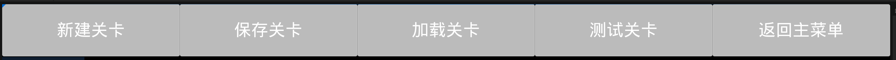
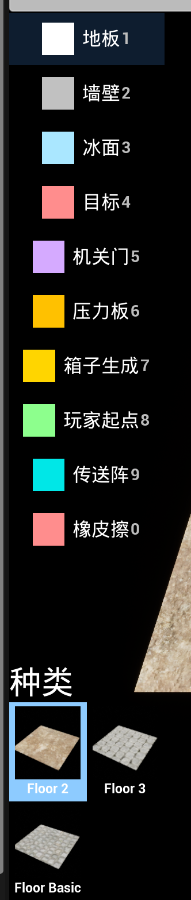
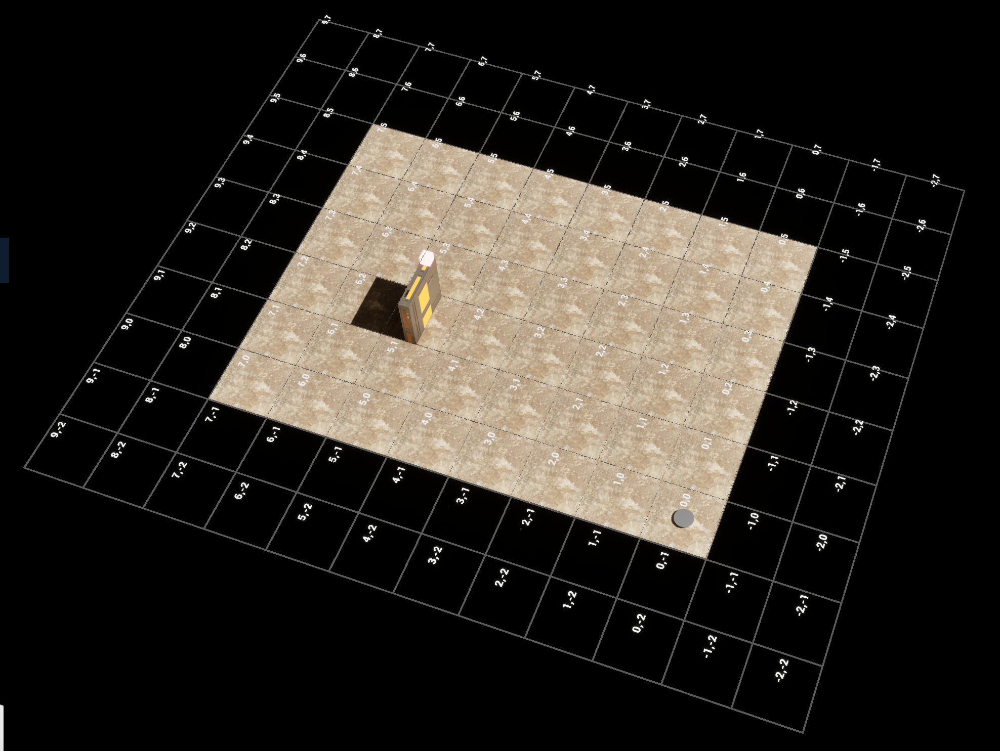

# KuluoBishi (推箱子)

基于 Unreal Engine 5.5 的推箱子解谜游戏 Demo，内置运行时关卡编辑器，支持自定义关卡的创建与游玩。

> **[技术策划文档](DESIGN.md)** — 设计思路、编辑器工具设计、扩展性设计、关卡设计说明
>
> **[技术文档](TECHNICAL.md)** — 系统架构、核心子系统、数据流、设计模式

---

## 试玩说明

### 关卡模式

- **开始游戏** — 游戏自带 5 关，按顺序解锁，前三关为教程引导，后两关为示例关卡
- **自定义关卡** — 通过编辑器创建的关卡

### 基本操作

- **WASD** — 控制角色在网格上四方向移动，按住可持续移动
- 角色面前有箱子时，会自动推动箱子前进
- **R键撤销** — 走错了可以逐步撤回，支持任意步数回退
- **ESC暂停菜单** — 可重新开始或返回关卡选择

### 游戏目标

将所有箱子推到目标点（Goal）即可通关。

### 关卡机制

| 地块类型 | 说明 |
|---------|------|
| **地板 Floor** | 普通可通行地块 |
| **墙壁 Wall** | 不可通行障碍 |
| **目标点 Goal** | 箱子的目的地，所有目标被占满即通关 |
| **压力板 Pressure Plate** | 箱子放上后触发机关，可联动开门 |
| **门 Door** | 默认关闭阻挡通行，由压力板组控制开关；同一组可包含多个门，所有门同时开关 |
| **冰面 Ice** | 角色和箱子在冰面上持续滑行，直到碰到障碍物停下 |
| **传送阵 Teleporter** | 成对放置，支持双向和单向传送 |

---

## 关卡编辑器

从主菜单进入关卡编辑器，可以自由设计推箱子关卡。

### 基本操作

- **左键** — 放置当前笔刷
- **右键** — 擦除格子
- **中键拖拽** — 平移视角
- **滚轮** — 缩放视角
- **1-0 数字键** — 切换笔刷
- **G 键** — 切换网格线/坐标标签覆盖层

### 工具栏

| 操作 | 说明 |
|------|------|
| **新建 New** | 创建指定尺寸的空白关卡 |
| **保存 Save** | 将当前关卡保存为 JSON 文件 |
| **加载 Load** | 加载已有的自定义关卡 |
| **测试 Test** | 直接进入游玩模式测试当前关卡 |
| **返回 Back** | 返回主菜单 |

### 笔刷系统

侧边栏提供 10 种笔刷（快捷键 1-0），左键绘制，右键擦除：

Floor、Wall、Ice、Goal、Door、Pressure Plate、Box Spawn、Player Start、Teleporter、Eraser

### 分组机制

门和压力板通过"组"进行关联：

1. 放置门后自动创建新组并进入压力板放置模式，为该门关联压力板
2. 同一组内所有压力板被触发后，该组所有门同时打开
3. 一组可以包含多个门：在 Group Manager 面板选中已有门组后再放置门，新门会自动加入该组；在压力板放置模式下也可切换到门笔刷继续往同组添加门
4. 通过 Group Manager 面板管理所有分组，点击选中/再次点击取消选中，支持删除和自定义颜色
5. 同组机关在编辑器和游戏中以相同颜色显示，便于辨识

传送阵同样通过分组配对，放置时自动进入配对模式。编辑器中会在配对的传送阵之间绘制箭头连线，直观显示传送关系。

### 编辑器可视化辅助

按 **G 键** 循环切换编辑器覆盖层：无 → 网格线 → 坐标标签 → 两者同时显示。传送阵箭头连线始终可见。

### 关卡验证

保存或测试时自动验证关卡合法性：
- 是否存在玩家出生点和目标点
- 门是否正确关联了压力板组
- 传送阵是否成对放置
- 是否放置了箱子
